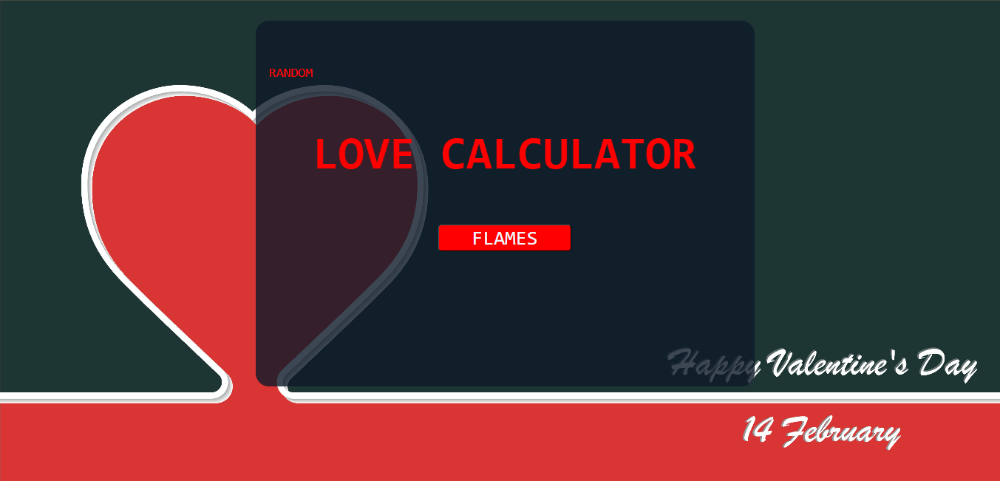

# LoveCalculator

	
	

LoveCalculator is a fun web app that uses the classic FLAMES logic to predict relationship compatibility between two names. It also features a random compatibility generator for quick
playful results, perfect for friends, couples, or anyone curious about their love score!

Discover your love destiny with LoveCalculator! Enter two names and let our FLAMES based algorithm reveal your romantic connection. Or, try the Random Love Percentage Generator to get a
spontaneous compatibility score, for fun, laughs, and maybe even surprises!

Test your compatibility with our FLAMES love calculator and random love percentage generator. Fun, quick, and made for everyone who believes in a little love magic!
